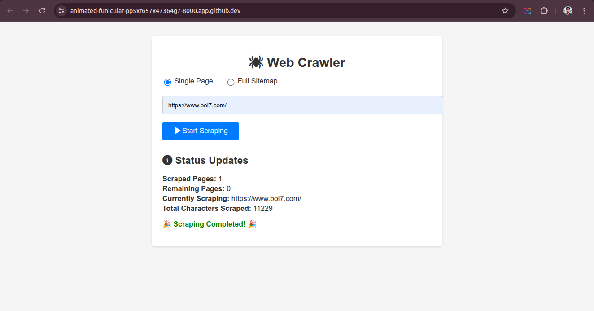
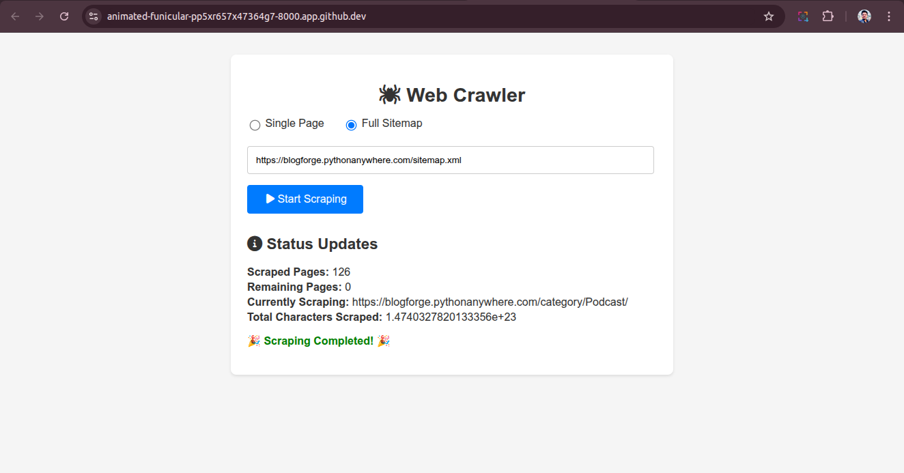

# Steps to run:

```bash
python -m venv .venv
source .venv/bin/activate
pip install -r requirements.txt
playwright install
sudo playwright install-deps
cd crawler
python manage.py migrate
python manage.py runserver
```



